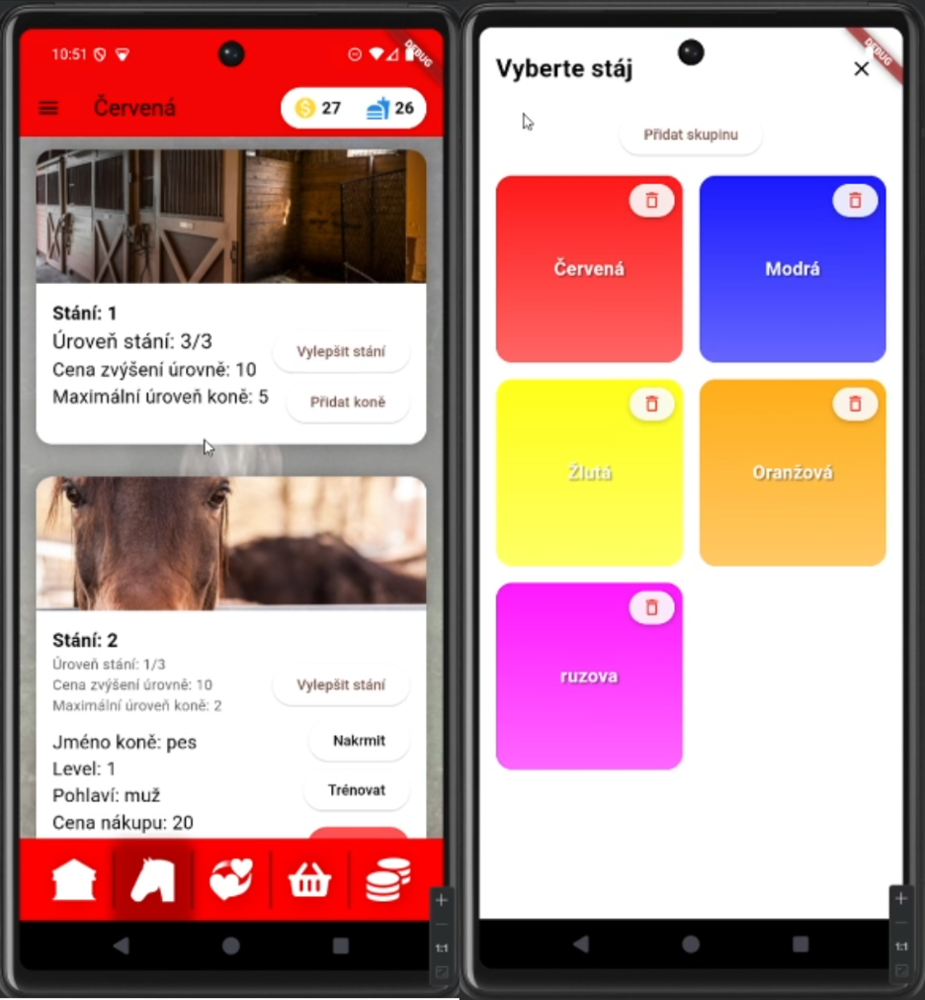

# Horse Stable Management App

A cross-platform app built for the ITU course project at VUT FIT. The application lets users manage multiple competing teams running their own horse stables, handling resources, training, and horse breeding.

---



---

## How It Works

The app is built around several core management mechanics:

* **Teams:** You can create and switch between multiple teams, each styled with its own custom color scheme that stays consistent across the entire user interface.
* **Resources & Shop:** Every team manages its own financial capital, water supply, and hay. You can spend money in the shop to buy new horses, water, or hay.
* **Trainers:** Trainers range from level 1 to 7. Their level dictates how many horses they can train (upgrading a horse by one star) each day, and the app tracks your daily usage.
* **Stables & Stalls:** Stables range from level 1–5, determining how many stalls are available. Individual stalls have levels 1–3, which limit the maximum level of horse they can house. Both stables and individual stalls can be upgraded using in-game money.
* **Horses & Breeding:** Horses have levels 1–5 and a gender (stallion or mare). They consume food and water daily, and you can feed, water, train, and breed them. When breeding horses, the starting quality of the foal is calculated based on the rounded-down average star rating of the parent horses.

---

## Tech Stack & Architecture

* **Backend:** Python / Flask (`itu-project-be`) handling the API and data logic.
* **Frontend:** Flutter optimized for cross-platform mobile deployment (Android and iOS).

### App Structure (Flutter Frontend)

* `lib/main.dart` – App entry point, routing, and team color customization sliders.
* `lib/overviewScreen.dart` – Overview dashboard for stables and trainers.
* `lib/horseScreen.dart` – Management view for individual horses and stalls.
* `lib/shopScreen.dart` – Shop interface for buying resources and horses.
* `lib/moneyScreen.dart` – Financial management and currency tracking.
* `lib/matingScreen.dart` – Breeding interface for pairing horses.
* `lib/api_stuff.dart` – Network communication layer for talking to the Flask backend.
* `assets/` – Icons, themed UI assets, and graphics.

---

## Installation & Running

Both the backend and frontend are designed to be run locally.

### 1. Run the Backend

Install the required Python packages:

```bash
pip install flask
pip install flask_cors

```

Start the server:

* **Windows:**
```bash
python itu-project-be\api\api.py

```


* **Linux / macOS:**
```bash
python3 itu-project-be/api/api.py

```


### 2. Run the Frontend

Navigate to your Flutter project directory, fetch dependencies, and launch the app:

```bash
flutter pub get
flutter run

```

*(Recommended: run via Android Studio using an emulator such as Pixel 6).*